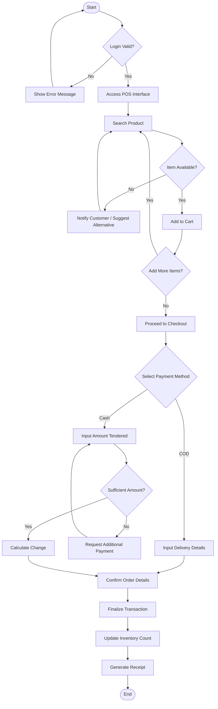

# Chapter III – DESIGN AND METHODOLOGY

## Research Design

This study utilizes a developmental research design, a systematic approach focused on the design, development, and evaluation of instructional products and tools (Richey & Klein, 2020). The primary objective is to create a functional Lumber Management System that addresses the specific operational inefficiencies identified in the lumberyards of Mahayag, Zamboanga del Sur. Unlike purely descriptive research that observes phenomena, this study actively intervenes by engineering a technological solution. The process involves a cyclical analysis of user needs, translating them into technical specifications, and constructing a software artifact. This design is appropriate because the study aims to produce a tangible output—the web-based application—that directly solves practical problems in inventory and sales management (Developmental Research in Software Engineering, 2021).

To complement the developmental aspect, a descriptive method is employed to assess the current state of lumberyard operations. Data gathering techniques such as direct observation and unstructured interviews with business owners and staff provide the qualitative data necessary to understand existing workflows. This initial phase is crucial for establishing a baseline against which the effectiveness of the new system is measured. By documenting the frequency of errors in manual computations and the time consumed per transaction, the study constructs a clear picture of the "problem space" before introducing the solution. This dual approach ensures that the resulting software is not just technically sound but also contextually relevant to the daily realities of the intended users (Creswell & Creswell, 2022).

## Software Development Methodology

To ensure a structured and disciplined approach to software construction, this project adopts the **Waterfall Model**. This linear, sequential methodology is chosen for its clarity and rigidity, which is highly effective when requirements are well-understood and fixed before development begins (Sommerville, 2021). In the context of the Lumber Management System, the core functionalities—inventory tracking, board feet calculation, and sales reporting—are standard operational requirements that are unlikely to change drastically during the development process. The Waterfall Model divides the project into distinct phases, where each phase must be completed and approved before the next one begins. This step-by-step progression minimizes the risk of scope creep and ensures that every component is fully documented and validated before moving forward (IEEE Standard for Software Life Cycle Processes, 2020).

### Phase 1: Requirement Analysis

The initial phase focuses on gathering and analyzing the specific needs of the stakeholders. The researcher conducts detailed interviews with lumberyard owners, cashiers, and inventory managers in Mahayag to elicit their functional requirements. This process involves identifying the specific types of wood sold, the dimensions commonly used, and the preferred method of recording sales. The goal is to produce a comprehensive System Requirements Specification (SRS) document. This document serves as the "contract" for the project, clearly defining what the system will do, such as the exact formula for board feet scaling and the specific fields needed for supplier delivery receipts. Establishing these requirements early prevents costly misunderstandings later in the development cycle (Requirements Engineering Journal, 2022).

### Phase 2: System Design

With the requirements clearly defined, the project moves to the design phase. Here, the logical and technical architecture of the system is constructed. The researcher creates Entity-Relationship Diagrams (ERD) to model the database structure, ensuring that products, categories, suppliers, and transactions are correctly linked. User Interface (UI) wireframes are designed to visualize the dashboard, forms, and reports, prioritizing a layout that is intuitive for non-technical users. This phase also creates the system architecture diagram, mapping out how the Django backend communicates with the database and the frontend client. The output of this phase is a "blueprint" that guides the actual coding process, ensuring that the development is deliberate and organized rather than haphazard (System Architecture & Design, 2021).

### Phase 3: Implementation

This phase involves the actual translation of the design specifications into executable code. Using the **Programming Environment** defined in the previous chapter, the researcher writes the source code for the application. The Django framework is initialized, models are migrated to the database, and the views and templates are constructed using Python and HTML5/Tailwind CSS. This is where the "heavy lifting" occurs, building the specific features such as the auto-calculation logic for lumber volume and the PDF generation triggers. Strict coding standards are followed to ensure the software is maintainable and efficient. As each module is built, it is integrated into the main application, transforming the abstract design into a working software product (Clean Code Practices, 2023).

### Phase 4: Testing

Once the coding is complete, the system undergoes rigorous testing to identify and fix defects. This phase employs "Unit Testing" to verify that individual components, like the board feet calculator, produce mathematically correct results. Following this, "Integration Testing" ensures that different modules—such as inventory updating automatically after a sale—work together seamlessly. Finally, "User Acceptance Testing" (UAT) is conducted with a select group of actual users from Mahayag. They are given specific tasks to perform on the system, and their feedback is collected to identify usability issues or bugs that technical testing might have missed. The objective is to ensure the system is robust, error-free, and ready for deployment (Software Quality Assurance Journal, 2022).

### Phase 5: Deployment and Maintenance

The final phase marks the transition of the system from a development environment to a live operational setting. The server is configured, the database is populated with initial real-world data (such as the current stock list of the partner lumberyard), and client workstations are set up with the necessary browser shortcuts. Training sessions are conducted to teach the staff how to use the new tools effectively. After deployment, the project enters a maintenance mode where the system is monitored for any unexpected behavior. Minor adjustments and patches are applied as needed to ensure continuous smooth operation. This phase confirms that the solution is not just a theoretical success but a practical utility that delivers value to the business (IT Service Management, 2021).

## System Architecture

The following Activity Diagram illustrates the operational flow of the Lumber Management System, detailing the sequence of actions for two primary user roles: the Admin/Inventory Manager and the Cashier. This visual representation clarifies the logic governing the system's core processes, from user authentication to transaction completion.

### Figure 1. Activity Diagram for Admin/Inventory Manager (Stock Management)


**Description:**
The flowchart above depicts the administrative workflow. Upon successful login, the Admin or Inventory Manager is presented with the main dashboard. If they choose to manage inventory, they can view current stock levels. When adding new stock (e.g., from a supplier delivery), the user inputs the raw dimensions, and the system's logic automatically computes the volume in board feet before saving the transaction to the database. Alternatively, the user can generate reports by selecting specific criteria, which the system processes to produce a downloadable PDF file.

### Figure 2. Activity Diagram for Cashier (Sales Process)



**Description:**
The second diagram illustrates the sales workflow for the Cashier. After logging in, the Cashier accesses the Point of Sale (POS) interface. The process involves searching for products requested by the customer; if an item is out of stock, the system prompts the user to notify the customer. Available items are added to a digital shopping cart. Once the selection is complete, the checkout process begins. The system handles different payment flows, checking for sufficient cash or capturing necessary delivery information for Cash-on-Delivery (COD) orders. Finally, the transaction is finalized, which triggers an automatic deduction from the inventory database and generates a transaction receipt.

## Use Case Diagram

The Use Case Diagram below visually represents the system's functionality from the perspective of the actors involved. It defines the interactions between the users (Administrator, Inventory Manager, and Cashier) and the various modules of the Lumber Management System.

### Figure 3. Use Case Diagram of the Proposed System

```mermaid
usecaseDiagram
    actor Admin as "Administrator"
    actor Inv as "Inventory Manager"
    actor Cashier as "Cashier"
    
    package "Lumber Management System" {
        usecase "Login / Logout" as UC1
        usecase "Manage User Accounts" as UC2
        usecase "Manage Product/Inventory" as UC3
        usecase "Calculate Board Feet" as UC4
        usecase "Manage Suppliers" as UC5
        usecase "Process Sales Transaction" as UC6
        usecase "Generate Digital Receipt" as UC7
        usecase "Generate Reports (PDF)" as UC8
        usecase "View Activity Logs" as UC9
    }

    %% Relationships for Administrator
    Admin --> UC1
    Admin --> UC2
    Admin --> UC3
    Admin --> UC4
    Admin --> UC5
    Admin --> UC6
    Admin --> UC7
    Admin --> UC8
    Admin --> UC9

    %% Relationships for Inventory Manager
    Inv --> UC1
    Inv --> UC3
    Inv --> UC4
    Inv --> UC5
    Inv --> UC8

    %% Relationships for Cashier
    Cashier --> UC1
    Cashier --> UC6
    Cashier --> UC7
    Cashier --> UC3

    %% Includes
    UC3 ..> UC4 : <<include>>
    UC6 ..> UC7 : <<include>>
```

**Description:**
The diagram identifies three primary actors: the **Administrator**, the **Inventory Manager**, and the **Cashier**. 
*   The **Administrator** possesses full access privileges, capable of performing all system functions including managing user accounts (creating new staff logins) and viewing comprehensive activity logs. 
*   The **Inventory Manager** focuses on the supply side, responsible for managing product data, handling supplier interactions, and generating inventory reports. A key interaction here is the "Calculate Board Feet" use case, which is an integral part of managing inventory.
*   The **Cashier** is primarily concerned with the sales process. Their permissions are limited to processing transactions, generating receipts, and viewing product availability (inventory) to answer customer queries. 
The diagram also illustrates dependencies, such as the "Process Sales Transaction" use case automatically including the "Generate Digital Receipt" function, highlighting the system's automated workflow.

## Sequence Diagram

The Sequence Diagram illustrates the step-by-step interaction between the user and the system components over time. It details how the system processes a sales transaction, from the initial product search to the final database update and receipt generation.

### Figure 4. Sequence Diagram for Sales Transaction Process


**Description:**
The sequence diagram details the interaction between the Cashier, the System Backend, and the Database during a sale. It highlights the logic for real-time stock verification and the conditional branching for different payment methods. Crucially, it shows that the inventory update and transaction storage happen sequentially, ensuring data integrity before the digital receipt is generated for the customer.

### Figure 5. Sequence Diagram for Inventory Management and Board Feet Calculation


**Description:**
This diagram illustrates the process of updating inventory, focusing on the system's internal computational logic. When an Administrator or Inventory Manager inputs wood dimensions, the system performs an immediate board feet calculation. Upon submission, the system ensures that both the inventory levels are updated and an audit trail (log entry) is created, maintaining accountability for all stock changes.

## Class Diagram

The Class Diagram represents the static structure of the Lumber Management System, showing the system's classes, their attributes, methods, and the relationships between objects. This structural model is essential for understanding how data is organized and how the different modules of the application (Inventory, Sales, and Authentication) interact at the database level.

### Figure 6. Figure


**Description:**
The Class Diagram highlights the central role of the `LumberProduct` class, which connects the inventory and sales modules. The `Inventory` class maintains a one-to-one relationship with products for real-time tracking, while `StockTransaction` provides a historical ledger of movements. On the sales side, a `SalesOrder` links a `Customer` to multiple `SalesOrderItem` entries, which in turn reference specific products. The `CustomUser` class acts as the actor for all sensitive operations, ensuring that every stock update and sale is tied to a specific system user (Admin or Cashier) for auditing purposes. This architecture ensures data normalization and referential integrity across the entire management system.
